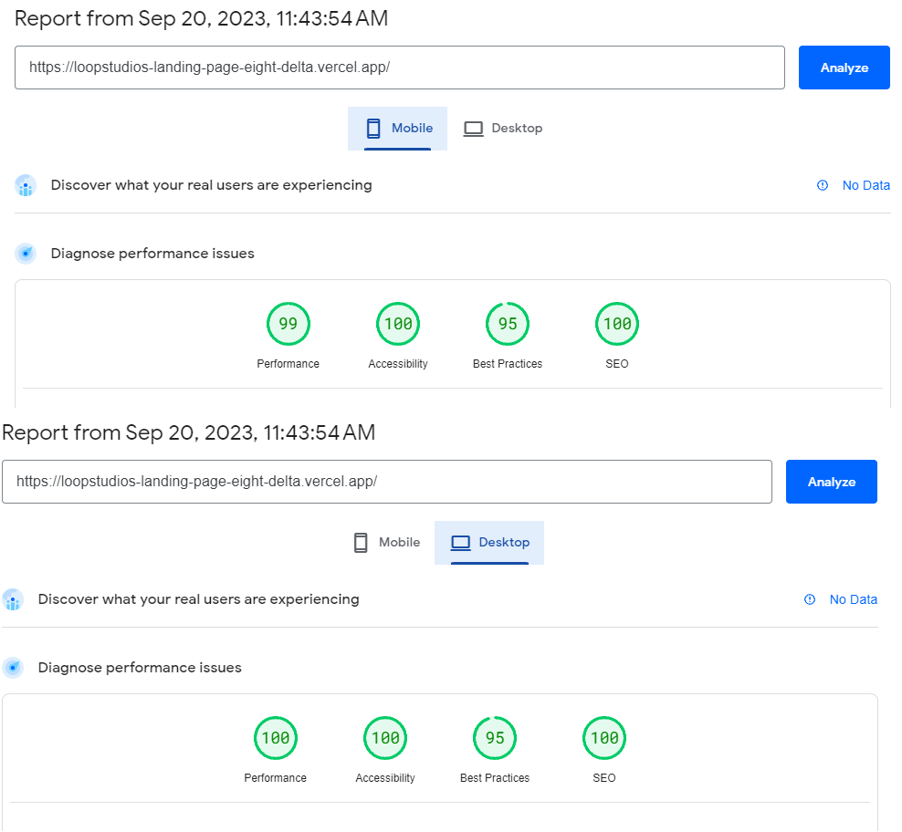

# Loopstudios -Responsive Landing Page

## Table of contents

- [Overview](#overview)
  - [The challenge](#the-challenge)
  - [Screenshot](#screenshot)
  - [PageSpeed Insights Report](#pagespeed-insights-report)
  - [Links](#links)
- [My process](#my-process)
  - [Built with](#built-with)
  - [What I learned](#what-i-learned)
  - [Continued development](#continued-development)
  - [Useful resources](#useful-resources)
- [Author](#author)
- [Design](#design/project)

## Overview

### The challenge

Users should be able to:

- View the optimal layout for the site depending on their device's screen size
- See hover states for all interactive elements on the page
- Toggle the color scheme between light and dark mode
- Site should recognize prefered color scheme from browser

### Screenshot

### PageSpeed Insights Report

Note:
On mobile size result in performance drop to 86, room for improvement and optimization for sure

### Links

- Live Site URL: [Live Site](https://loopstudios-landing-page-eight-delta.vercel.app/)

## My process

### Built with

- Semantic HTML5 markup
- CSS custom properties
- Flexbox
- CSS Grid
- Mobile-first workflow
- [Typescropt](https://www.typescriptlang.org/) - Typescript
- [Next.js](https://nextjs.org/) - React framework
- [Tailwind CSS](https://tailwindcss.com/) - For styles

### What I learned

An excellent exercise in creating a responsive landing page from a Figma design.

### Continued development

Add other pages apart from landing.

### Useful resources

- [Tailwind docs](https://tailwindcss.com/docs/) - Always useful when working with tailwind.

## Design/Project

This is a solution to the [Loopstudios landing page challenge on Frontend Mentor](https://www.frontendmentor.io/challenges/loopstudios-landing-page-N88J5Onjw). Frontend Mentor challenges help you improve your coding skills by building realistic projects.

## Author

- Linkedin - [Tomislav Sertic](https://www.linkedin.com/in/tomislav-serti%C4%87-85a0941a3/)
- Frontend Mentor - [@tsertic](https://www.frontendmentor.io/profile/tsertic)
- Instagram - [@tsertic5](https://www.instagram.com/tsertic5/)
